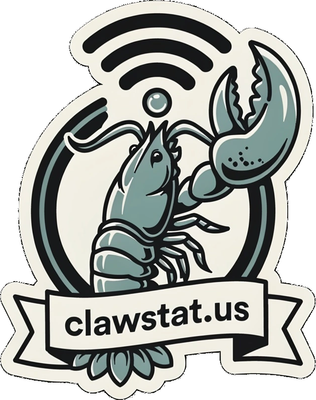
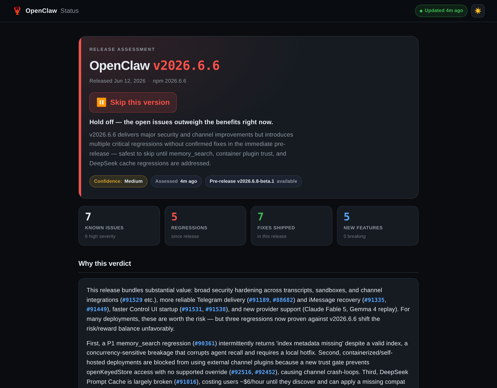

<p align="center">
  
</p>

# OpenClaw Status

**Should you update to the latest OpenClaw release?** This tool answers that.

[](https://clawstat.us)

<p align="center">
  
  <br>
  <em>The generated decision page — a verdict-first dashboard backed by scored, version-relevant bug evidence (<a href="docs/hero-light.png">light theme</a>).</em>
</p>

It watches the [`openclaw/openclaw`](https://github.com/openclaw/openclaw) repo, scouts
the bugs people are actually hitting after a release — ranked by community impact and by
whether they affect the version being assessed — asks an LLM to weigh the evidence, and
renders a single decision page with a clear verdict:

| Verdict | Meaning |
|---------|---------|
| ✅ Update now | No blocking issues found |
| ⚠️ Update with precautions | Worthwhile, but back up first — real risk remains |
| ⏸️ Skip this version | The open issues outweigh the benefits |

When a fix is already staged in a pre-release, the verdict stays ⏸️/⚠️ (the fix isn't in the
released version yet) and the page flags the pre-release tag, so you know relief is near without
the answer pretending the current release is safe.

The verdict isn't a vibe — it's the end of an evidence pipeline that scouts real post-release
bug reports, scores them against the repo's own severity labels, and has **two different LLM
providers** argue it out before anything ships.

### Highlights

- **Independent multi-model review** — the analyst and validator are *different* providers
  (DeepSeek + Qwen, with MiniMax as fallback), so no model rubber-stamps its own reasoning and a
  single-vendor outage can't sink a run.
- **Evidence-ranked scouting** — issues are scored from the repo's real `P0…P4` / breakage / harm
  labels and ranked by severity *blended with whether the bug affects the assessed version*, so a
  confirmed regression outranks a critical about some other release.
- **Safe by construction** — a zero-dependency static page that builds its DOM with `textContent`
  (XSS-safe) and no inline handlers (CSP-clean), even though every field is untrusted LLM text.
- **Ships only trustworthy pages** — a deploy guard refuses low-confidence or invalid assessments,
  an HTML smoke test runs *before* the old page is overwritten, and each page is archived to a
  browsable per-version snapshot.
- **For humans *and* machines** — the verdict ships as an interactive page, a JSON API
  (`latest.json`), an RSS feed, a status badge, and an agent-readable mirror (`llms.txt`), plus
  server-rendered HTML + JSON-LD so search engines and agents read the answer without running JS.
- **Honest about fresh releases** — a just-dropped version is flagged as an *early read* (back up;
  the verdict firms up over the next few runs) until version-specific reports accrue.

**Live demo: <https://clawstat.us>** — running on an AWS Lightsail box: a systemd timer pulls
the latest code and runs the full collect → assess → render pipeline on an adaptive cadence
(an hourly tick that catches a new release within the hour and reassesses more often right after
a release), and Caddy serves the result over auto-HTTPS. The whole host is scripted in [`deploy/`](deploy/) (one
`provision.sh` run).

---

## How it works

The app is a small Python package (`openclaw_status/`) driven by one CLI. Each run flows
through three stages: **collect → assess → render**.

```
 GitHub API (issues + releases, via token)
 npm registry                                ┐
 Clawsweeper-state (raw GitHub files)        │
        │                                    │
        ▼                                    │
 collect ──► data/raw-data.json              │  data sources
        │                                    │
        ▼                                    ┘
 assess  ──► data/assessment.json   (OpenRouter LLM: analyst → validator → refine)
        │            └─► data/history.json (per-version verdicts), data/timeline.json
        │                (per-run metric snapshots → Trends), data/usage.json (cost log)
        ▼
 render  ──► web/index.html         (public decision page)
```

### 1. Collect — `openclaw_status/collector.py`

Gathers everything from first-party sources only (no third-party data brokers):

- **GitHub issues** — scouted and scored (see below). *GitHub API, token.*
- **GitHub releases** — the latest stable, the most recent pre-release, and a short
  release history for the timeline. *GitHub REST API, token.*
- **npm registry** — the latest published version (release-detection signal). *public.*
- **Clawsweeper-state** — an automated triage bot's per-issue verdicts (`decision`,
  `fixed_release`) plus its work-candidate / recently-closed lists. *raw GitHub files.*

Output: `data/raw-data.json`, with a completeness gate (aborts if both npm and the GitHub
release fail) and a pipeline timeout.

### 2. Issue scouting — `openclaw_status/github.py` (the core)

This is what makes the verdict trustworthy. For the assessed version it runs three GitHub
searches, **all sorted by 👍 reactions** and excluding feature requests:

1. issues opened **since the release** (candidate regressions — not gated on any `bug`
   label, so freshly-filed, un-triaged breakage is still caught),
2. issues the maintainers flagged **top priority** (`label:P1`),
3. the **most-reacted open issues** overall (ongoing majors of any age).

Each issue is then scored from the repo's real labels:

- **Severity** comes from the maintainer **priority labels** `P0…P4`, bumped one level for
  a breakage label (`regression`/`crash`/`data-loss`) and floored at *high* for a serious
  harm area (`impact:security` / `data` / `message-loss` / `session-state` / `auth-provider`).
  *(The `issue-rating: 🦞 diamond lobster` label is a quality rating — it appears on feature
  requests too — so it is **not** treated as a severity.)*
- **Impact** = a bucket from 👍 reactions + comment volume.
- **`affects_version`** = the issue text mentions the assessed version or its minor series.
- **Category** = `regression` (a *confirmed* regression — a `regression` label or a
  "regression" title; not merely any post-release bug) / `post_release` (filed after the
  release and affects this version, but not confirmed as a regression) / `diamond_lobster` /
  `active`.

Results are **ranked by severity blended with version-relevance** (an issue confirmed in the
assessed version outranks a critical about some *other* version, but a trivial version
mention can't outrank a real critical), tie-broken by community impact. Feature requests and
proposals are dropped — a wished-for feature is no reason to skip an update. Finally, an
issue is marked **fixed** only if the release/pre-release body explicitly closes it
(`fixes/closes/resolves #N`), not for any bare `#N` (usually a PR number).

### 3. Assess — `openclaw_status/agent.py`

A multi-step LLM pipeline over [OpenRouter](https://openrouter.ai):

1. **Analyst** (`deepseek/deepseek-v4-pro`, high reasoning) produces a structured
   assessment from the collected data. Only the top-N issues by rank are fed to the
   prompt (`config.MAX_ISSUES_IN_CONTEXT`) and the output budget is widened
   (`config.ASSESSMENT_MAX_TOKENS`) so the JSON doesn't truncate on busy releases.
2. **Validator** (`qwen/qwen3.7-plus`) — a *different* provider from the analyst, so it's
   an independent second opinion, not the model checking its own work. It re-derives each
   top issue's severity / category (regression vs post-release) / platform from the raw data
   rather than trusting the analyst's labels, and flags missed issues, **mis-categorizations**,
   and unsupported claims. A spotted mis-categorization forces a refinement pass even if the
   validator otherwise agrees — so the analyst's first answer is never taken as correct by
   default.
3. **Refine** (analyst again) — only if the validator disagrees.

If the analyst call fails, it falls back to `minimax/minimax-m3` — a third distinct provider,
so a single-vendor outage doesn't sink the run (and the analyst and validator stay on
different models). All models are served via OpenRouter.

The output is schema- and XSS-validated, appended to `data/history.json`, and cost/latency
is logged to `data/usage.json` (with daily/monthly budget alerts). Result shape:
`recommendation`, `confidence`, `thesis`, `evidence` (for/against/neutral), `known_issues`,
`changes` (fixes/features/breaking), `sentiment_summary`, `platform_impact`.

### 4. Render — `openclaw_status/render.py`

Injects the pipeline data into `web/template.html` (via a `<script type="application/json">`
block) and writes **`web/index.html`** — a zero-dependency, dark/light, mobile-responsive page
that builds its DOM with `textContent` (XSS-safe) and no inline handlers (CSP-clean). A **deploy
guard** refuses to publish a low-confidence or invalid assessment, and an **HTML smoke test**
validates the page before it overwrites the previous one. The page leads with the decision
(verdict, key-metric tiles, **Your setup** stack personalisation, reasoning) and groups the
supporting detail — Impact meters, changelog, Trends charts, past verdicts — behind tabs, with
the filterable Known-issues list below. A just-dropped release (published within
`config.FRESH_RELEASE_DAYS` of the run) leads with a **fresh-release notice** and tempers the
"cleared / complete" copy until version-specific reports accrue.

Each render also emits the same verdict in other shapes beside the page (all static, served by
Caddy):

- **`latest.json`** — the full payload as a documented public **JSON API**; the page also
  `fetch()`es it at runtime to refresh data without an HTML rebuild (the inlined copy is the
  offline fallback). Carries a `schema_version` so consumers can guard against shape drift.
- **`feed.xml`** + **`badge.svg`** — an RSS feed of verdicts and an embeddable shields-style
  status badge (`[](https://clawstat.us)`).
- **`llms.txt`** / **`llms-full.txt`** — an [agent-readable mirror](https://llmstxt.org) of the
  verdict as clean markdown, for an LLM/agent that can't run the page's JS.
- **Browsable archive** — the outgoing page is snapshotted to `web/archive/<version>.html`
  (retention `config.ARCHIVE_KEEP`); past-version snapshots self-canonicalise for their own
  search query, and "Past verdicts" links each one.
- **SEO** — a server-rendered `<h1>` answer + dynamic `<title>`/meta/Open-Graph + JSON-LD
  (`WebSite`/`WebPage`/`FAQPage`) so the verdict is crawlable without JS, plus `robots.txt` +
  `sitemap.xml` each render.
- **`timeline.json`** — one append-only metric snapshot per run (the data behind the Trends
  charts); per-run cost & latency stay on disk, out of the public payload.

> Per-issue API note: **`severity`** is the harm class (from the repo's `P0…P4` + breakage/impact
> labels), while **`impact`** is a *community-engagement* bucket (👍 + comments) — different axes
> that intentionally diverge, so filter on `severity` for "how bad is it".

---

## Setup

Requires **Python 3.10+** (no other system tools — all HTTP uses the standard library).

```bash
pip install -r requirements.txt
cp .env.example .env      # then fill in the two keys
```

`.env` (gitignored) needs:

- **`OPENROUTER_API_KEY`** — for the LLM assessment. Get one at openrouter.ai.
- **`GITHUB_TOKEN`** — for all GitHub reads. Least privilege is a **fine-grained PAT** with
  *Repository access → Public repositories (read-only)* and *Issues: Read-only* +
  *Metadata: Read-only* (or a classic token with **no scopes**). See `.env.example`.
- **`ALERT_WEBHOOK_URL`** *(optional)* — a Slack or Discord incoming webhook. When set,
  cost/budget/failure alerts and a run-completion summary are POSTed there (the payload key is
  auto-selected: Discord gets `content`, everything else `text`). Leave blank for stdout-only
  alerts. **It's a secret** (the URL embeds a token) — keep it in `.env`, never in git.

> Note: GitHub's UI only exposes the per-permission tab once you pick a repository scope, so
> selecting *All repositories* (read-only) is fine too — it grants no more than public read.

### Usage

```bash
python3 run.py collect             # gather data            → data/raw-data.json
python3 run.py assess              # LLM assessment         → data/assessment.json
python3 run.py render-assessment   # public page            → web/index.html
python3 run.py full                # collect → assess → render-assessment (concurrency-locked)
python3 run.py notify-test ["msg"] # send a test alert to ALERT_WEBHOOK_URL (verify the webhook)
```

A full run takes **several minutes** end-to-end — usually ~5 min, up to ~10+ when the validator
disagrees and the analyst refines — almost all of it the analyst/validator LLM reasoning; collect
and render are seconds. Cost is a few cents/run typically, up to ~$0.08 on a refinement run.

To preview the page, open `web/index.html` in a browser.

### Tests

```bash
python3 -m pytest        # 228 tests, hermetic (no network)
```

The suite covers the scouting/scoring logic, input sanitization, the assessment-output
validator, the data-injection contract, and the HTML smoke test.

---

## Deploy (self-host)

The live site at <https://clawstat.us> runs on a small Ubuntu VM (AWS Lightsail): a systemd
timer ticks hourly and rebuilds the page on an adaptive cadence, and Caddy terminates HTTPS.
The whole host is scripted in
[`deploy/`](deploy/) (provision script + systemd unit/timer + Caddyfile). On a fresh box with
this repo cloned to `/opt/openclaw_status_app`:

```bash
sudo deploy/provision.sh <your-domain>     # deps + Caddy + venv + the systemd timer
sudo nano /opt/openclaw_status_app/.env    # OPENROUTER_API_KEY + GITHUB_TOKEN (+ ALERT_WEBHOOK_URL)
sudo -u openclaw /opt/openclaw_status_app/.venv/bin/python run.py full   # seed the first page
```

Point the domain's DNS A-record at the box and open ports 80/443 — Caddy issues the TLS cert
automatically. After that, the timer ticks hourly — picking up a new release within the hour and
otherwise reassessing on an adaptive cadence (every 6h while a release is fresh, then 8h, then 12h;
see `config.ASSESS_CADENCE_TIERS`), so shipping a change is just `git push`. Useful on-box commands: `journalctl -u openclaw-status.service -f`
(logs), `systemctl list-timers openclaw-status.timer` (schedule), `sudo systemctl start
openclaw-status.service` (runs a tick now — gates; use `run.py full` to force a full assessment).
Changes under `deploy/` need a re-run of `provision.sh`
to reinstall the `/etc` copies.

---

## Project layout

```
openclaw_status_app/
├── run.py                  entry point
├── requirements.txt
├── .env.example            template for the two API keys
├── openclaw_status/
│   ├── cli.py              the unified CLI
│   ├── collector.py        stage 1 — gather data
│   ├── github.py           GitHub API client + issue scouting/scoring
│   ├── agent.py            stage 2 — LLM assessment pipeline
│   ├── render.py           stage 3 — public decision page
│   ├── lib.py              shared utils (OpenRouter, sanitize, locks, usage, timer)
│   └── config.py           paths, models, env
├── web/
│   ├── template.html       production frontend template (data injected here)
│   ├── index.html          generated public page (gitignored)
│   ├── latest.json         generated runtime-fetch payload (gitignored)
│   └── archive/            per-version page snapshots (gitignored)
├── docs/                   README screenshots (hero-dark.png / hero-light.png)
├── deploy/                 AWS provisioning: provision.sh, systemd unit+timer, Caddyfile
├── .github/workflows/      ci.yml (hermetic tests on every push)
├── tests/                  pytest suite
└── data/                   pipeline outputs (gitignored)
```
